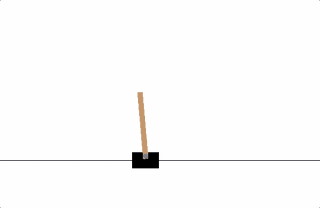
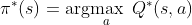
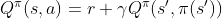
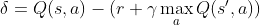
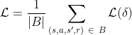
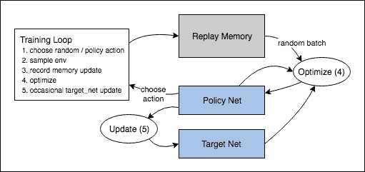

# 强化学习（DQN）教程

> 原文：<https://pytorch.org/tutorials/intermediate/reinforcement_q_learning.html>

**作者**： [Adam Paszke](https://github.com/apaszke)

本教程说明如何使用 PyTorch 在 [OpenAI Gym](https://gym.openai.com/) 上的 CartPole-v0 任务上训练深度 Q 学习（DQN）智能体。

**任务**

智能体必须在两个动作之间做出决定-向左或向右移动推车-以便使与之相连的杆子保持直立。 您可以在 [Gym 网站](https://gym.openai.com/envs/CartPole-v0)上找到具有各种算法和可视化效果的官方排行榜。



卡特波尔

当智能体观察环境的当前状态并选择一个动作时，环境*会转换为*到新状态，并且还会返回表示该动作后果的奖励。 在此任务中，每增加一个时间步长，奖励为 +1，并且如果杆子掉落得太远或手推车离中心的距离超过 2.4 个单位，则环境终止。 这意味着表现更好的方案将持续更长的时间，从而积累更大的回报。

对 CartPole 任务进行了设计，以使对智能体的输入是代表环境状态（位置，速度等）的 4 个实际值。 但是，神经网络可以完全通过查看场景来解决任务，因此我们将以推车为中心的一部分屏幕作为输入。 因此，我们的结果无法直接与官方排行榜上的结果进行比较-我们的任务更加艰巨。 不幸的是，这确实减慢了训练速度，因为我们必须渲染所有帧。

严格来说，我们将状态显示为当前屏幕补丁与前一个屏幕补丁之间的差异。 这将允许智能体从一张图像中考虑极点的速度。

**包**

首先，让我们导入所需的包。 首先，我们需要针对环境的 [Gym](https://gym.openai.com/docs)（使用`pip install Gym`进行安装）。 我们还将使用 PyTorch 中的以下内容：

*   神经网络（`torch.nn`）
*   优化（`torch.optim`）
*   自动微分（`torch.autograd`）
*   视觉任务的工具（`torchvision`-[单独的包](https://github.com/pytorch/vision)）。

```py
import gym
import math
import random
import numpy as np
import matplotlib
import matplotlib.pyplot as plt
from collections import namedtuple
from itertools import count
from PIL import Image

import torch
import torch.nn as nn
import torch.optim as optim
import torch.nn.functional as F
import torchvision.transforms as T

env = gym.make('CartPole-v0').unwrapped

# set up matplotlib
is_ipython = 'inline' in matplotlib.get_backend()
if is_ipython:
    from IPython import display

plt.ion()

# if gpu is to be used
device = torch.device("cuda" if torch.cuda.is_available() else "cpu")

```

## 回放记忆

我们将使用经验回放记忆来训练我们的 DQN。 它存储智能体观察到的转换，使我们以后可以重用此数据。 通过从中随机采样，可以构建批量的转换相关。 已经表明，这极大地稳定和改善了 DQN 训练程序。

为此，我们将需要两个类：

*   `Transition`-表示我们环境中单个过渡的命名元组。 它本质上将（状态，动作）对映射到其（下一个状态，奖励）结果，该状态是屏幕差异图像，如下所述。
*   `ReplayMemory`-有界大小的循环缓冲区，用于保存最近观察到的转换。 它还实现了`.sample()`方法，用于选择随机的过渡批量进行训练。

```py
Transition = namedtuple('Transition',
                        ('state', 'action', 'next_state', 'reward'))

class ReplayMemory(object):

    def __init__(self, capacity):
        self.capacity = capacity
        self.memory = []
        self.position = 0

    def push(self, *args):
        """Saves a transition."""
        if len(self.memory) < self.capacity:
            self.memory.append(None)
        self.memory[self.position] = Transition(*args)
        self.position = (self.position + 1) % self.capacity

    def sample(self, batch_size):
        return random.sample(self.memory, batch_size)

    def __len__(self):
        return len(self.memory)

```

现在，让我们定义我们的模型。 但是首先，让我们快速回顾一下 DQN 是什么。

## DQN 算法

我们的环境是确定性的，因此为简单起见，此处介绍的所有方程式也都确定性地制定。 在强化学习文献中，它们还将包含对环境中随机转变的期望。

我们的目标是制定一种策略，尝试最大化折扣的累积奖励`R[t[0]] = Σ γ^(t - t[0]) r[t], t = t[0] -> ∞`，其中`R[t[0]]`也称为*回报*。 折扣`γ`应该是`0`和`1`之间的常数，以确保总和收敛。 这使得来自不确定的遥远未来的回报对我们的智能体而言不如可以对其充满信心的近期回报重要。

Q 学习的主要思想是，如果我们有一个函数`Q*：State x Action => R`，这可以告诉我们，如果我们在给定状态下采取行动，那么我们就可以轻松地制定出使我们的回报最大化的策略：



但是，我们对世界一无所知，因此无法访问`Q*`。 但是，由于神经网络是通用函数逼近器，因此我们可以简单地创建一个并将其训练为类似于`Q*`的函数。

对于我们的训练更新规则，我们将使用一个事实，即某些策略的每个`Q`函数都遵循贝尔曼方程：



等式两侧之间的差异称为时间差异误差`delta`：



为了最小化此误差，我们将使用 [Huber 损失](https://en.wikipedia.org/wiki/Huber_loss)。 当误差较小时，Huber 损失的作用类似于均方误差，而当误差较大时，则表现为平均绝对误差-当`Q`的估计值非常嘈杂时，这使它对异常值的鲁棒性更高。 我们通过从重播内存中采样的一批过渡`B`来计算：



### Q 网络

我们的模型将是一个卷积神经网络，该卷积神经网络将吸收当前屏幕补丁和先前屏幕补丁之间的差异。 它有两个输出，分别代表`Q(s, left)`和`Q(s, right)`（其中`s`是网络的输入）。 实际上，网络正在尝试预测在给定当前输入的情况下执行每个操作的*预期收益*。

```py
class DQN(nn.Module):

    def __init__(self, h, w, outputs):
        super(DQN, self).__init__()
        self.conv1 = nn.Conv2d(3, 16, kernel_size=5, stride=2)
        self.bn1 = nn.BatchNorm2d(16)
        self.conv2 = nn.Conv2d(16, 32, kernel_size=5, stride=2)
        self.bn2 = nn.BatchNorm2d(32)
        self.conv3 = nn.Conv2d(32, 32, kernel_size=5, stride=2)
        self.bn3 = nn.BatchNorm2d(32)

        # Number of Linear input connections depends on output of conv2d layers
        # and therefore the input image size, so compute it.
        def conv2d_size_out(size, kernel_size = 5, stride = 2):
            return (size - (kernel_size - 1) - 1) // stride  + 1
        convw = conv2d_size_out(conv2d_size_out(conv2d_size_out(w)))
        convh = conv2d_size_out(conv2d_size_out(conv2d_size_out(h)))
        linear_input_size = convw * convh * 32
        self.head = nn.Linear(linear_input_size, outputs)

    # Called with either one element to determine next action, or a batch
    # during optimization. Returns tensor([[left0exp,right0exp]...]).
    def forward(self, x):
        x = F.relu(self.bn1(self.conv1(x)))
        x = F.relu(self.bn2(self.conv2(x)))
        x = F.relu(self.bn3(self.conv3(x)))
        return self.head(x.view(x.size(0), -1))

```

### 输入提取

以下代码是用于从环境中提取和处理渲染图像的工具。 它使用`torchvision`包，可轻松组成图像变换。 一旦运行单元，它将显示它提取的示例补丁。

```py
resize = T.Compose([T.ToPILImage(),
                    T.Resize(40, interpolation=Image.CUBIC),
                    T.ToTensor()])

def get_cart_location(screen_width):
    world_width = env.x_threshold * 2
    scale = screen_width / world_width
    return int(env.state[0] * scale + screen_width / 2.0)  # MIDDLE OF CART

def get_screen():
    # Returned screen requested by gym is 400x600x3, but is sometimes larger
    # such as 800x1200x3\. Transpose it into torch order (CHW).
    screen = env.render(mode='rgb_array').transpose((2, 0, 1))
    # Cart is in the lower half, so strip off the top and bottom of the screen
    _, screen_height, screen_width = screen.shape
    screen = screen[:, int(screen_height*0.4):int(screen_height * 0.8)]
    view_width = int(screen_width * 0.6)
    cart_location = get_cart_location(screen_width)
    if cart_location < view_width // 2:
        slice_range = slice(view_width)
    elif cart_location > (screen_width - view_width // 2):
        slice_range = slice(-view_width, None)
    else:
        slice_range = slice(cart_location - view_width // 2,
                            cart_location + view_width // 2)
    # Strip off the edges, so that we have a square image centered on a cart
    screen = screen[:, :, slice_range]
    # Convert to float, rescale, convert to torch tensor
    # (this doesn't require a copy)
    screen = np.ascontiguousarray(screen, dtype=np.float32) / 255
    screen = torch.from_numpy(screen)
    # Resize, and add a batch dimension (BCHW)
    return resize(screen).unsqueeze(0).to(device)

env.reset()
plt.figure()
plt.imshow(get_screen().cpu().squeeze(0).permute(1, 2, 0).numpy(),
           interpolation='none')
plt.title('Example extracted screen')
plt.show()

```

## 训练

### 超参数和工具

该单元实例化我们的模型及其优化器，并定义一些工具：

*   `select_action`-将根据 ε 贪婪策略选择一个动作。 简而言之，有时我们会使用模型来选择操作，有时我们会统一采样。 选择随机动作的可能性将从`EPS_START`开始，并朝`EPS_END`呈指数衰减。 `EPS_DECAY`控制衰减率。
*   `plot_durations`-绘制剧集持续时间以及最近 100 个剧集的平均值（官方评估中使用的度量）的助手。 该图将在包含主要训练循环的单元下面，并且将在每个剧集之后更新。

```py
BATCH_SIZE = 128
GAMMA = 0.999
EPS_START = 0.9
EPS_END = 0.05
EPS_DECAY = 200
TARGET_UPDATE = 10

# Get screen size so that we can initialize layers correctly based on shape
# returned from AI gym. Typical dimensions at this point are close to 3x40x90
# which is the result of a clamped and down-scaled render buffer in get_screen()
init_screen = get_screen()
_, _, screen_height, screen_width = init_screen.shape

# Get number of actions from gym action space
n_actions = env.action_space.n

policy_net = DQN(screen_height, screen_width, n_actions).to(device)
target_net = DQN(screen_height, screen_width, n_actions).to(device)
target_net.load_state_dict(policy_net.state_dict())
target_net.eval()

optimizer = optim.RMSprop(policy_net.parameters())
memory = ReplayMemory(10000)

steps_done = 0

def select_action(state):
    global steps_done
    sample = random.random()
    eps_threshold = EPS_END + (EPS_START - EPS_END) * \
        math.exp(-1\. * steps_done / EPS_DECAY)
    steps_done += 1
    if sample > eps_threshold:
        with torch.no_grad():
            # t.max(1) will return largest column value of each row.
            # second column on max result is index of where max element was
            # found, so we pick action with the larger expected reward.
            return policy_net(state).max(1)[1].view(1, 1)
    else:
        return torch.tensor([[random.randrange(n_actions)]], device=device, dtype=torch.long)

episode_durations = []

def plot_durations():
    plt.figure(2)
    plt.clf()
    durations_t = torch.tensor(episode_durations, dtype=torch.float)
    plt.title('Training...')
    plt.xlabel('Episode')
    plt.ylabel('Duration')
    plt.plot(durations_t.numpy())
    # Take 100 episode averages and plot them too
    if len(durations_t) >= 100:
        means = durations_t.unfold(0, 100, 1).mean(1).view(-1)
        means = torch.cat((torch.zeros(99), means))
        plt.plot(means.numpy())

    plt.pause(0.001)  # pause a bit so that plots are updated
    if is_ipython:
        display.clear_output(wait=True)
        display.display(plt.gcf())

```

### 训练循环

最后，是训练模型的代码。

在这里，您可以找到执行优化步骤的`optimize_model`函数。 它首先对一批进行采样，将所有张量连接为一个张量，计算`Q(s[t], a[t])`和`V(s[t+1])= max[a] Q(s[t+1], a)`，并将其合并为我们的损失。 根据定义，如果`s`为终端状态，则设置`V(s) = 0`。 我们还使用目标网络来计算`V(s[t+1])`，以提高稳定性。 目标网络的权重大部分时间保持冻结状态，但经常更新以策略网络的权重。 通常这是一组固定的步骤，但是为了简单起见，我们将使用剧集。

```py
def optimize_model():
    if len(memory) < BATCH_SIZE:
        return
    transitions = memory.sample(BATCH_SIZE)
    # Transpose the batch (see https://stackoverflow.com/a/19343/3343043 for
    # detailed explanation). This converts batch-array of Transitions
    # to Transition of batch-arrays.
    batch = Transition(*zip(*transitions))

    # Compute a mask of non-final states and concatenate the batch elements
    # (a final state would've been the one after which simulation ended)
    non_final_mask = torch.tensor(tuple(map(lambda s: s is not None,
                                          batch.next_state)), device=device, dtype=torch.bool)
    non_final_next_states = torch.cat([s for s in batch.next_state
                                                if s is not None])
    state_batch = torch.cat(batch.state)
    action_batch = torch.cat(batch.action)
    reward_batch = torch.cat(batch.reward)

    # Compute Q(s_t, a) - the model computes Q(s_t), then we select the
    # columns of actions taken. These are the actions which would've been taken
    # for each batch state according to policy_net
    state_action_values = policy_net(state_batch).gather(1, action_batch)

    # Compute V(s_{t+1}) for all next states.
    # Expected values of actions for non_final_next_states are computed based
    # on the "older" target_net; selecting their best reward with max(1)[0].
    # This is merged based on the mask, such that we'll have either the expected
    # state value or 0 in case the state was final.
    next_state_values = torch.zeros(BATCH_SIZE, device=device)
    next_state_values[non_final_mask] = target_net(non_final_next_states).max(1)[0].detach()
    # Compute the expected Q values
    expected_state_action_values = (next_state_values * GAMMA) + reward_batch

    # Compute Huber loss
    loss = F.smooth_l1_loss(state_action_values, expected_state_action_values.unsqueeze(1))

    # Optimize the model
    optimizer.zero_grad()
    loss.backward()
    for param in policy_net.parameters():
        param.grad.data.clamp_(-1, 1)
    optimizer.step()

```

在下面，您可以找到主要的训练循环。 首先，我们重置环境并初始化`state`张量。 然后，我们采样一个动作，执行它，观察下一个屏幕和奖励（总是 1），并一次优化我们的模型。 当剧集结束（我们的模型失败）时，我们重新开始循环。

下面，将`num_episodes`设置得较小。 您应该下载笔记本并运行更多的片段，例如 300 多个片段，才能显着改善持续时间。

```py
num_episodes = 50
for i_episode in range(num_episodes):
    # Initialize the environment and state
    env.reset()
    last_screen = get_screen()
    current_screen = get_screen()
    state = current_screen - last_screen
    for t in count():
        # Select and perform an action
        action = select_action(state)
        _, reward, done, _ = env.step(action.item())
        reward = torch.tensor([reward], device=device)

        # Observe new state
        last_screen = current_screen
        current_screen = get_screen()
        if not done:
            next_state = current_screen - last_screen
        else:
            next_state = None

        # Store the transition in memory
        memory.push(state, action, next_state, reward)

        # Move to the next state
        state = next_state

        # Perform one step of the optimization (on the target network)
        optimize_model()
        if done:
            episode_durations.append(t + 1)
            plot_durations()
            break
    # Update the target network, copying all weights and biases in DQN
    if i_episode % TARGET_UPDATE == 0:
        target_net.load_state_dict(policy_net.state_dict())

print('Complete')
env.render()
env.close()
plt.ioff()
plt.show()

```

这是说明总体结果数据流的图。



可以随机选择或根据策略选择动作，从健身环境中获取下一步样本。 我们将结果记录在重播内存中，并在每次迭代时运行优化步骤。 优化会从重播内存中随机抽取一批来进行新策略的训练。 “较旧”的`target_net`也用于优化计算期望的 Q 值； 有时会对其进行更新以使其保持最新状态。

**脚本的总运行时间**：（0 分钟 0.000 秒）

[下载 Python 源码：`reinforcement_q_learning.py`](../_downloads/b8954cc7b372cac10a92b8c6183846a3/reinforcement_q_learning.py)

[下载 Jupyter 笔记本：`reinforcement_q_learning.ipynb`](../_downloads/2b3f06b04b5e96e4772746c20fcb4dcc/reinforcement_q_learning.ipynb)

[由 Sphinx 画廊](https://sphinx-gallery.readthedocs.io)生成的画廊