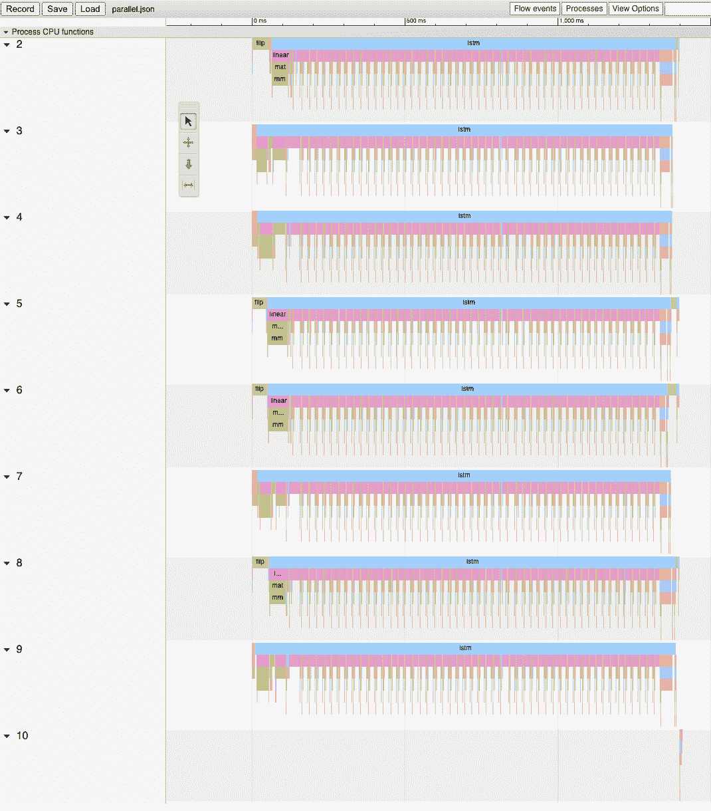

# TorchScript 中的动态并行性

> 原文：<https://pytorch.org/tutorials/advanced/torch-script-parallelism.html>

在本教程中，我们介绍在 TorchScript 中执行*动态互操作并行化*的语法。 此并行性具有以下属性：

*   动态-创建的并行任务的数量及其工作量可能取决于程序的控制流。
*   互操作-并行性与并行运行 TorchScript 程序片段有关。 这与*运算内部并行化*不同，后者涉及拆分单个运算符并并行运行运算符工作的子集。

## 基本语法

动态并行的两个重要 API 是：

*   `torch.jit.fork(fn : Callable[..., T], *args, **kwargs) -> torch.jit.Future[T]`
*   `torch.jit.wait(fut : torch.jit.Future[T]) -> T`

通过示例来演示这些工作原理的好方法：

```py
import torch

def foo(x):
    return torch.neg(x)

@torch.jit.script
def example(x):
    # Call `foo` using parallelism:
    # First, we "fork" off a task. This task will run `foo` with argument `x`
    future = torch.jit.fork(foo, x)

    # Call `foo` normally
    x_normal = foo(x)

    # Second, we "wait" on the task. Since the task may be running in
    # parallel, we have to "wait" for its result to become available.
    # Notice that by having lines of code between the "fork()" and "wait()"
    # call for a given Future, we can overlap computations so that they
    # run in parallel.
    x_parallel = torch.jit.wait(future)

    return x_normal, x_parallel

print(example(torch.ones(1))) # (-1., -1.)

```

`fork()`接受可调用`fn`以及该可调用`args`和`kwargs`的参数，并创建异步任务来执行`fn`。 `fn`可以是函数，方法或模块实例。 `fork()`返回对此执行结果的值的引用，称为`Future`。 因为`fork`在创建异步任务后立即返回，所以在执行`fork()`调用之后的代码行时可能尚未执行`fn`。 因此，`wait()`用于等待异步任务完成并返回值。

这些结构可用于重叠函数内语句的执行（如工作示例部分所示），或与其他语言结构（如循环）组合在一起：

```py
import torch
from typing import List

def foo(x):
    return torch.neg(x)

@torch.jit.script
def example(x):
    futures : List[torch.jit.Future[torch.Tensor]] = []
    for _ in range(100):
        futures.append(torch.jit.fork(foo, x))

    results = []
    for future in futures:
        results.append(torch.jit.wait(future))

    return torch.sum(torch.stack(results))

print(example(torch.ones([])))

```

注意

当我们初始化一个空的期货列表时，我们需要在`futures`上添加一个显式类型注解。 在 TorchScript 中，空容器默认假定它们包含张量值，因此我们将列表构造器`#`注解为`List[torch.jit.Future[torch.Tensor]]`类型

本示例使用`fork()`启动函数`foo`的 100 个实例，等待 100 个任务完成，然后对结果求和，返回`-100.0`。

## 应用示例：双向 LSTM 的集成

让我们尝试将并行性应用于一个更现实的示例，看看我们可以从中获得什么样的性能。 首先，让我们定义基准模型：双向 LSTM 层的集合。

```py
import torch, time

# In RNN parlance, the dimensions we care about are:
# # of time-steps (T)
# Batch size (B)
# Hidden size/number of "channels" (C)
T, B, C = 50, 50, 1024

# A module that defines a single "bidirectional LSTM". This is simply two
# LSTMs applied to the same sequence, but one in reverse
class BidirectionalRecurrentLSTM(torch.nn.Module):
    def __init__(self):
        super().__init__()
        self.cell_f = torch.nn.LSTM(input_size=C, hidden_size=C)
        self.cell_b = torch.nn.LSTM(input_size=C, hidden_size=C)

    def forward(self, x : torch.Tensor) -> torch.Tensor:
        # Forward layer
        output_f, _ = self.cell_f(x)

        # Backward layer. Flip input in the time dimension (dim 0), apply the
        # layer, then flip the outputs in the time dimension
        x_rev = torch.flip(x, dims=[0])
        output_b, _ = self.cell_b(torch.flip(x, dims=[0]))
        output_b_rev = torch.flip(output_b, dims=[0])

        return torch.cat((output_f, output_b_rev), dim=2)

# An "ensemble" of `BidirectionalRecurrentLSTM` modules. The modules in the
# ensemble are run one-by-one on the same input then their results are
# stacked and summed together, returning the combined result.
class LSTMEnsemble(torch.nn.Module):
    def __init__(self, n_models):
        super().__init__()
        self.n_models = n_models
        self.models = torch.nn.ModuleList([
            BidirectionalRecurrentLSTM() for _ in range(self.n_models)])

    def forward(self, x : torch.Tensor) -> torch.Tensor:
        results = []
        for model in self.models:
            results.append(model(x))
        return torch.stack(results).sum(dim=0)

# For a head-to-head comparison to what we're going to do with fork/wait, let's
# instantiate the model and compile it with TorchScript
ens = torch.jit.script(LSTMEnsemble(n_models=4))

# Normally you would pull this input out of an embedding table, but for the
# purpose of this demo let's just use random data.
x = torch.rand(T, B, C)

# Let's run the model once to warm up things like the memory allocator
ens(x)

x = torch.rand(T, B, C)

# Let's see how fast it runs!
s = time.time()
ens(x)
print('Inference took', time.time() - s, ' seconds')

```

在我的机器上，该网络运行时间为`2.05`秒。 我们可以做得更好！

## 并行化前向和后向层

我们可以做的一个非常简单的事情是在`BidirectionalRecurrentLSTM`中并行化前进和后退层。 为此，计算结构是静态的，因此我们实际上甚至不需要任何循环。 像这样重写`BidirectionalRecurrentLSTM`的`forward`方法：

```py
def forward(self, x : torch.Tensor) -> torch.Tensor:
    # Forward layer - fork() so this can run in parallel to the backward
    # layer
    future_f = torch.jit.fork(self.cell_f, x)

    # Backward layer. Flip input in the time dimension (dim 0), apply the
    # layer, then flip the outputs in the time dimension
    x_rev = torch.flip(x, dims=[0])
    output_b, _ = self.cell_b(torch.flip(x, dims=[0]))
    output_b_rev = torch.flip(output_b, dims=[0])

    # Retrieve the output from the forward layer. Note this needs to happen
    # *after* the stuff we want to parallelize with
    output_f, _ = torch.jit.wait(future_f)

    return torch.cat((output_f, output_b_rev), dim=2)

```

在此示例中，`forward()`将`cell_f`的执行委派给另一个线程，而它继续执行`cell_b`。 这导致两个单元的执行彼此重叠。

通过简单的修改再次运行脚本会产生`1.71`秒的运行时间，从而改进了`17%`！

## 旁注：可视化并行性

我们还没有完成模型的优化，但是值得介绍一下用于可视化性能的工具。 一种重要的工具是 [PyTorch 分析器](https://pytorch.org/docs/stable/autograd.html#profiler)。

让我们将分析器与 Chrome 跟踪导出功能一起使用，以可视化并行模型的性能：

此代码段将写出名为`parallel.json`的文件。 如果您将 Google Chrome 浏览器导航到`chrome://tracing`，单击`Load`按钮，然后加载该 JSON 文件，则应该看到类似以下的时间轴：


时间轴的横轴表示时间，纵轴表示执行线程。 如我们所见，我们一次运行两个`lstm`实例。 这是我们辛勤工作使双向层平行的结果！

## 集成中的并行化模型

您可能已经注意到，我们的代码中还有更多的并行化机会：我们还可以并行运行`LSTMEnsemble`中包含的模型。 做到这一点的方法很简单，这就是我们应该更改`LSTMEnsemble`的`forward`方法的方式：

```py
def forward(self, x : torch.Tensor) -> torch.Tensor:
    # Launch tasks for each model
    futures : List[torch.jit.Future[torch.Tensor]] = []
    for model in self.models:
        futures.append(torch.jit.fork(model, x))

    # Collect the results from the launched tasks
    results : List[torch.Tensor] = []
    for future in futures:
        results.append(torch.jit.wait(future))

    return torch.stack(results).sum(dim=0)

```

或者，如果您重视简洁性，我们可以使用列表推导：

```py
def forward(self, x : torch.Tensor) -> torch.Tensor:
    futures = [torch.jit.fork(model, x) for model in self.models]
    results = [torch.jit.wait(fut) for fut in futures]
    return torch.stack(results).sum(dim=0)

```

如介绍中所述，我们使用循环为集合中的每个模型分派任务。 然后，我们使用了另一个循环来等待所有任务完成。 这提供了更多的计算重叠。

通过此小更新，脚本将在`1.4`秒内运行，总速度为`32%`！ 两行代码相当不错。

我们还可以再次使用 Chrome 跟踪器来查看运行情况：



现在我们可以看到所有`LSTM`实例都在完全并行运行。

## 总结

在本教程中，我们学习了`fork()`和`wait()`，这是在 TorchScript 中执行动态，互操作并行的基本 API。 我们看到了一些典型的使用模式，这些模式使用这些函数并行执行 TorchScript 代码中的函数，方法或`Modules`的执行。 最后，我们通过一个使用该技术优化模型的示例进行了研究，并探索了 PyTorch 中可用的性能测量和可视化工具。