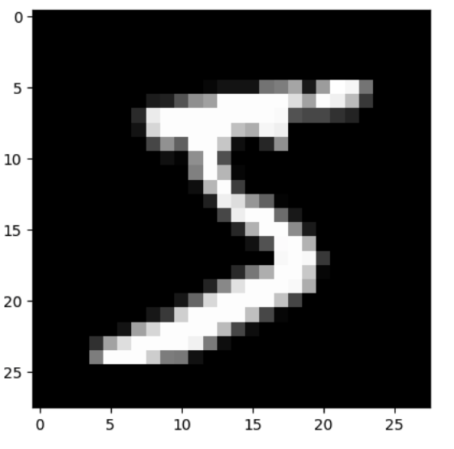

# `torch.nn`究竟是什么？

> 译者：[runzhi214](https://github.com/runzhi214)
>
> 项目地址：<https://pytorch.apachecn.org/2.0/tutorials/beginner/nn_tutorial>
>
> 原始地址：<https://pytorch.org/tutorials/beginner/nn_tutorial.html>

**作者**：Jeremy Howard, [fast.ai](https://www.fast.ai/). Thanks to Rachel Thomas and Francisco Ingham.

我们推荐把这个教程作为Notebook(.ipynb)而不是脚本来运行。点击页面顶部的[链接](https://pytorch.org/tutorials/_downloads/d9398fce39ca80dc4bb8b8ea55b575a8/nn_tutorial.ipynb)来下载Notebook。

PyTorch提供设计地很优雅的模块和类，比如[torch.nn](), [torch.optim](), [Dataset]() 和[DataLoader]()来帮助你创建和训练神经网络。为了能完全发挥它们的能力并自定义它们来解决你的问题，你需要切实的理解他们在做什么。为了让你由浅入深的理解，我们会在MNIST数据集上首先训练基本的神经网络，暂时还不使用任何这些模型的特性; 我们一开始只使用PyTorchtensor的最基本的功能。然后，我们会逐渐地从这些特性中每次增加一个，展示每一样究竟做了什么，以及它是如何让代码更加准确或者更加灵活的。

**在这个教程中，我们假设你已经安装了PyTorch，并且已经熟悉了tensor的基本运算。**(如果你对NumPy的数组操作很熟悉，那你会发现这里使用的PyTorch的tensor操作几乎一样)

## MNIST 数据准备

我们将使用经典的[MNIST](http://deeplearning.net/data/mnist/)数据集，它由许多手写的0～9之间的数字的黑白的图像组成。

我们将使用[pathlib库](https://docs.python.org/3/library/pathlib.html)来处理路径问题，并使用[requests库](http://docs.python-requests.org/en/master/)来下载数据集。我们只会在使用到它们的时候引入，所以你可以清晰地看到每一步究竟使用了什么。

```py
from pathlib import Path
import requests

DATA_PATH = Path("data")
PATH = DATA_PATH / "mnist"

PATH.mkdir(parents=True, exist_ok=True)

URL = "https://github.com/pytorch/tutorials/raw/main/_static/"
FILENAME = "mnist.pkl.gz"

if not (PATH / FILENAME).exists():
        content = requests.get(URL + FILENAME).content
        (PATH / FILENAME).open("wb").write(content)
```

该数据集采取numpy数组的格式，并且使用对象序列化(python特有的序列话数据的格式)来存储。

```py
import pickle
import gzip

with gzip.open((PATH / FILENAME).as_posix(), "rb") as f:
        ((x_train, y_train), (x_valid, y_valid), _) = pickle.load(f, encoding="latin-1")
```

每张图片的尺寸是28x28，作为长度为784的行(28x28展平为784)存储。让我们看一张图片，首先我们需要将它重塑为2维。

```py
from matplotlib import pyplot
import numpy as np

pyplot.imshow(x_train[0].reshape((28, 28)), cmap="gray")
# ``pyplot.show()`` only if not on Colab
try:
    import google.colab
except ImportError:
    pyplot.show()
print(x_train.shape)
```



Out:

```py
(50000, 784)
```

PyTorch使用`torch.tensor`而不是numpy数组，所以我们需要转换数据。

```py
import torch

x_train, y_train, x_valid, y_valid = map(
    torch.tensor, (x_train, y_train, x_valid, y_valid)
)
n, c = x_train.shape
print(x_train, y_train)
print(x_train.shape)
print(y_train.min(), y_train.max())
```

Out:

```py
tensor([[0., 0., 0.,  ..., 0., 0., 0.],
        [0., 0., 0.,  ..., 0., 0., 0.],
        [0., 0., 0.,  ..., 0., 0., 0.],
        ...,
        [0., 0., 0.,  ..., 0., 0., 0.],
        [0., 0., 0.,  ..., 0., 0., 0.],
        [0., 0., 0.,  ..., 0., 0., 0.]]) tensor([5, 0, 4,  ..., 8, 4, 8])
torch.Size([50000, 784])
tensor(0) tensor(9)
```

## 神经网络从零开始(不用`torch.nn`)

让我们首先只用PyTorchtensor操作来创建一个模型。我们假设你已经对神经网络的基本概念很熟悉了(如果你不熟悉，可以在[course.fast.ai](https://course.fast.ai/)学习一下)。

PyTorch提供创建填充了随机数或者零的tensor的方法，我们将用这些方法来创建一个简单线性模型的对应权重(tensor)和偏差值(tensor)。它们只是很普通的tensor，只有一点特殊：我们告诉PyTorch这些tensor需要梯度。这会让PyTorch记录所有在tensor上的运算，以便于它能够在反向传播的过程中自动计算梯度。

对于权重，我们在初始化**后**设置`requires_grad`,因为我们并不希望初始化的这一步也加入梯度(请注意: 在PyTorch中一个`_`标志着运算是原位(in-place)发生的)。

> 注意:
> 我们用 [ Xavier 初始化](http://proceedings.mlr.press/v9/glorot10a/glorot10a.pdf) 来初始化权重(即乘以`1/sqrt(n)`)。

```py
import math

weights = torch.randn(784, 10) / math.sqrt(784)
weights.requires_grad_()
bias = torch.zeros(10, requires_grad=True)
```

感谢PyTorch自动计算梯度的能力，我们可以使用任何Python函数作为模型！所以让我们写一个普通的矩阵乘法和广播加法来创建一个简单的线性模型。我们还需要一个激活函数，所以我们写`log_softmax`并用它做激活函数。请记住：尽管PyTorch提供了许多事先写好的损失函数、激活函数，你仍然可以用普通python写一个自己自定义的。PyTorch甚至会为你的函数自动创建更快的GPU代码或者向量化的CPU代码。

```py
def log_softmax(x):
    return x - x.exp().sum(-1).log().unsqueeze(-1)

def model(xb):
    return log_softmax(xb @ weights + bias)
```

在上面这段代码中，`@`代表矩阵乘法运算。我们在一批数据(在这个例子中是64张图片)上调用我们的函数。这是一次**前向传递**。注意：由于我们是从随机权重开始的，在这个阶段我们的预测值不会比随机数好多少。

```py
bs = 64  # 批大小

xb = x_train[0:bs]  # x中的一个微批
preds = model(xb)  # 预测
preds[0], preds.shape
print(preds[0], preds.shape)
```

Out:

```py
tensor([-2.5452, -2.0790, -2.1832, -2.6221, -2.3670, -2.3854, -2.9432, -2.4391,
        -1.8657, -2.0355], grad_fn=<SelectBackward0>) torch.Size([64, 10])
```

如你所见，`preds`tensor不仅包含tensor值，还包含了一个梯度函数。后面我们会用这个来做反向传播。让我们实现一个负对数似然来用做损失函数(我们仍然只用普通的Python)：

```py
def nll(input, target):
    return -input[range(target.shape[0]), target].mean()

loss_func = nll
```

让我们用我们的随机模型来检查一下损失值，以便观察在一次反向传播传递后模型是否改善了。

```py
yb = y_train[0:bs]
print(loss_func(preds, yb))
```

Out:

```py
tensor(2.4020, grad_fn=<NegBackward0>)
```

让我们再实现一个函数来计算模型的准确率。对于每个预测值，如果最大值的索引匹配目标值，那么预测就是准确的(即索引0-9分别代表预测数字为0-9的对应值)。

```py
def accuracy(out, yb):
    preds = torch.argmax(out, dim=1)
    return (preds == yb).float().mean()
```

让我们检查一下我们的随机模型的准确率，以便我们观察随着损失值改善了我们的准确率是否也改善了。

```py
print(accuracy(preds, yb))
```

Out:

```py
tensor(0.0938)
```

现在我们运行一个训练循环。在每次迭代中，我们将会:

- 选取一个微批的数据(数量为`bs`)
- 用模型来做预测
- 计算损失值
- `loss.backward()`更新模型的梯度，在这个例子中，意味着更新`weights`和`bias`。

现在我们用这些梯度来更新权重(`weights`)和偏差值(`bias`)。我在`torch.no_grad()`上下文管理器中这么做，因为我们不希望为下一次梯度计算记录这些动作。你可以在[这里](https://pytorch.org/docs/stable/notes/autograd.html)阅读更多关于PyTorch的Autograd如何记录运算。

然后我们将梯度设置为零，给下一轮循环做好准备。否则，我们的梯度会记录所有发生的运算的合计(也就是说，`loss.backward()` 会对存储的值**累加**梯度，而不是替代)。

> 提示:
> 你可以用标准Python调试器来逐步执行PyTorch代码，让你在每一步检查不同变量的值。取消注释下面的`set_trace()`来尝试一下。

```py
from IPython.core.debugger import set_trace

lr = 0.5  # learning rate
epochs = 2  # how many epochs to train for

for epoch in range(epochs):
    for i in range((n - 1) // bs + 1):
        # set_trace()
        start_i = i * bs
        end_i = start_i + bs
        xb = x_train[start_i:end_i]
        yb = y_train[start_i:end_i]
        pred = model(xb)
        loss = loss_func(pred, yb)

        loss.backward()
        with torch.no_grad():
            weights -= weights.grad * lr
            bias -= bias.grad * lr
            weights.grad.zero_()
            bias.grad.zero_()
```

写完了: 我们已经从零开始创建、训练了一个微型的神经网络(在这个例子中，一个逻辑回归，因为我们没有使用隐藏层)。

让我们检查损值和精确度，并和我们之前获取的值对比一下。我们预期损失值会下降、精确度会提升。事实证明确实如此:

```py
print(loss_func(model(xb), yb), accuracy(model(xb), yb))
```

Out:

```py
tensor(0.0813, grad_fn=<NegBackward0>) tensor(1.)
```

## 使用`torch.nn.functional`

现在我们要重构我们的代码，让它做和之前一样的事情，只不过我们开始利用PyTorch的`nn`包来让代码更加精准、更加灵活。从这里出发的每一步，我们都会让我们的代码变得或多或少: 更短、更易读，并且/或者 更灵活。

第一步也是最简单的一步是通过把我们手写的激活函数和损失函数用`torch.nn.functional`(按惯例通常被引入到命名空间F中)中的函数替代，来让代码更短。这个模块包含了`torch.nn`库中所有的函数(其他部分包含的是类)。除了各种各样的损失函数和激活函数之外，你还能在这里找到许多给创建神经网络提供便利的函数，比如池化函数(这里还有做卷积的函数、线性层的函数，但是我们会看到这些任务通常使用这个库其他部分的功能完成会更好)。

如果你使用负对数似然和log softmax激活函数，那么PyTorch给你提供了一个单独的结合这两者的函数`F.cross_entropy`。所以我们甚至可以从模型中把激活函数移除。

```py
import torch.nn.functional as F

loss_func = F.cross_entropy

def model(xb):
    return xb @ weights + bias
```

注意，我们在`model`函数中中不再调用`log_softmax`。让我们证实我们的损失值和准确率和之前是一样的。

```py
print(loss_func(model(xb), yb), accuracy(model(xb), yb))
```

Out:

```py
tensor(0.0813, grad_fn=<NllLossBackward0>) tensor(1.)
```

## 用`nn.Module`重构

下一步，我们将会使用`nn.Module`和`nn.Parameter`，来构建更简洁、更精准的训练循环。我们子类化`nn.Module`(自身是一个类且能够跟踪状态)。在这个例子中，我们想创建持有权重、偏差值和前向步骤方法的一个类。`nn.Module`有一些我们将会使用的属性和方法,比如`.parameters()`和`.zero_grad()`。

> 注意：
> `nn.Module`(大写M)是一个PyTorch特有概念，同时也是一个我们使用很多次的类。不要把`nn.Module`和Python的[模块(module，小写m)](https://docs.python.org/3/tutorial/modules.html)的概念混淆了，Python的module是一个可以引入的Python代码文件。

```py
from torch import nn

class Mnist_Logistic(nn.Module):
    def __init__(self):
        super().__init__()
        self.weights = nn.Parameter(torch.randn(784, 10) / math.sqrt(784))
        self.bias = nn.Parameter(torch.zeros(10))

    def forward(self, xb):
        return xb @ self.weights + self.bias
```

既然我们在使用一个对象而不是函数，我们首先必须实例化我们的模型:

```py
model = Mnist_Logistic()
```

现在我们可以像以前那样计算损失值。注意: `nn.Module`对象像函数一样被使用，(具体来说，它们都是*可调用*),在幕后，Pytorch会自动调用我们的`forward`方法。

```py
print(loss_func(model(xb), yb))
```

Out:

```py
tensor(2.3096, grad_fn=<NllLossBackward0>)
```

之前在我们的训练循环中，我们需要逐个参数地更新值，然后手动对每个参数清零梯度，像这样:

```py
with torch.no_grad():
    weights -= weights.grad * lr
    bias -= bias.grad * lr
    weights.grad.zero_()
    bias.grad.zero_()
```

现在我们使用`model.parameter()`和`model.zero_grad()`(都是PyTorch在`nn.Module`中定义的)来让这些步骤更简洁、更不可能发生一些比如在我们的模型非常复杂时忘记某些参数之类的错误。

我们将会把这个简单的训练循环包装在一个`fit`函数中以便之后再运行。

```py
def fit():
    for epoch in range(epochs):
        for i in range((n - 1) // bs + 1):
            start_i = i * bs
            end_i = start_i + bs
            xb = x_train[start_i:end_i]
            yb = y_train[start_i:end_i]
            pred = model(xb)
            loss = loss_func(pred, yb)

            loss.backward()
            with torch.no_grad():
                for p in model.parameters():
                    p -= p.grad * lr
                model.zero_grad()

fit()
```

让我们再检查一次损失值下降了:

```py
print(loss_func(model(xb), yb))
```

Out:

```py
tensor(0.0821, grad_fn=<NllLossBackward0>)
```

## 用`nn.Linear`重构

我们继续重构代码。我们会放弃手动定义、初始化`self.weights`和`self.bias`，然后用`xb  @ self.weights + self.bias`来计算这种方式，改用PyTorch的线性层类[nn.Linear](https://pytorch.org/docs/stable/nn.html#linear-layers)，它为我们自动完成了这些。PyTorch有多种多样的预定义的、可以帮我们大幅减少代码量的、通常速度也更快的层。

```py
class Mnist_Logistic(nn.Module):
    def __init__(self):
        super().__init__()
        self.lin = nn.Linear(784, 10)

    def forward(self, xb):
        return self.lin(xb)
```

我们实例化我们的模型然后像以前一样计算损失值:

```py
model = Mnist_Logistic()
print(loss_func(model(xb), yb))
```

Out:

```py
tensor(2.3313, grad_fn=<NllLossBackward0>)
```

我们仍然可以像之前一样使用同样的`fit`方法.

```py
fit()
print(loss_func(model(xb), yb))
```

Out:

```py
tensor(0.0819, grad_fn=<NllLossBackward0>)
```

## 用`torch.optim`重构

PyTorch有一个带了许多优化器算法的包,`torch.optim`。我们可以用优化器的`step`方法来完成一个前向步骤，而不是手动更新每个参数。

我们替换掉之前手写的优化步骤。

```py
with torch.no_grad():
    for p in model.parameters(): p -= p.grad * lr
    model.zero_grad()
```

取而代之的是：

```py
opt.step()
opt.zero_grad()
```

(`optim.zero_grad()`将梯度重置为0，我们需要在计算下一轮微批数据的梯度前调用这个方法)。

```py
from torch import optim
```

我们定义了一个函数来创建模型2和优化器，这样我们以后可以重用。

```py
def get_model():
    model = Mnist_Logistic()
    return model, optim.SGD(model.parameters(), lr=lr)

model, opt = get_model()
print(loss_func(model(xb), yb))

for epoch in range(epochs):
    for i in range((n - 1) // bs + 1):
        start_i = i * bs
        end_i = start_i + bs
        xb = x_train[start_i:end_i]
        yb = y_train[start_i:end_i]
        pred = model(xb)
        loss = loss_func(pred, yb)

        loss.backward()
        opt.step()
        opt.zero_grad()

print(loss_func(model(xb), yb))
```

Out:

```py
tensor(2.2659, grad_fn=<NllLossBackward0>)
tensor(0.0810, grad_fn=<NllLossBackward0>)
```

## 用DataSet重构

PyTorch有一个抽象的数据集(DataSet)类。一个数据集可以是任何带有`__len__`函数(被Python标准`len`函数调用)和`__getitem__`函数(作为索引方式访问内部内容的方法)的东西。[这个教程](https://pytorch.org/tutorials/beginner/data_loading_tutorial.html)演示了创建`DataSet`的自定义子类`FacialLandmarkDataset`的案例。

PyTorch的[Tensorflow DataSet](https://pytorch.org/docs/stable/_modules/torch/utils/data/dataset.html#TensorDataset)是一个包装了tensor的数据集。通过定义长度和索引方法，它给我们提供了一种根据tensor第一维进行迭代、索引、切片的方法。这将会让我们更轻松地在训练中用一行代码来同时访问访问独立变量和非独立变量。

```py
from torch.utils.data import TensorDataset
```

`x_train`和`y_train`可以结合在一个`TensorDataset`里，切片和遍历都更容易。

```py
train_ds = TensorDataset(x_train, y_train)
```

之前，我们需要在微批中分别遍历`x`和`y`:

```py
xb = x_train[start_i:end_i]
yb = y_train[start_i:end_i]
```

现在我们可以把两步结合起来.

```py
xb,yb = train_ds[i*bs : i*bs+bs]
```

```py
model, opt = get_model()

for epoch in range(epochs):
    for i in range((n - 1) // bs + 1):
        xb, yb = train_ds[i * bs: i * bs + bs]
        pred = model(xb)
        loss = loss_func(pred, yb)

        loss.backward()
        opt.step()
        opt.zero_grad()

print(loss_func(model(xb), yb))
```

Out:

```py
tensor(0.0826, grad_fn=<NllLossBackward0>)
```

## 用`DataLoader`重构

PyTorch的`DataLoader`(数据加载器类)可以管理微批数据。你可以从任何`DataSet`出发创建`DataLoader`。`DataLoader`使得在批上遍历更加容易。它会自动给我们生成每一个微批数据，而不用我们调用`train_ds[i*bs : i*bs+bs]`。

```py
from torch.utils.data import DataLoader

train_ds = TensorDataset(x_train, y_train)
train_dl = DataLoader(train_ds, batch_size=bs)
```

之前，我们在`(xb, yb)`批数据上遍历的循环看起来像这样:

```py
for i in range((n-1)//bs + 1):
    xb,yb = train_ds[i*bs : i*bs+bs]
    pred = model(xb)
```

现在我们的循环更加简洁，因为`(xb, yb)`会自动从数据加载器中加载。

```py
for xb,yb in train_dl:
    pred = model(xb)
```

```py
model, opt = get_model()

for epoch in range(epochs):
    for xb, yb in train_dl:
        pred = model(xb)
        loss = loss_func(pred, yb)

        loss.backward()
        opt.step()
        opt.zero_grad()

print(loss_func(model(xb), yb))
```

Out:

```py
tensor(0.0818, grad_fn=<NllLossBackward0>)
```

感谢PyTorch的`nn.Module`, `nn.Parameter`, `Dataset`, 和 `DataLoader`, 我们的训练循环现在急剧缩小了且更加易懂。让我们尝试添加简单的必备特性来创建更实用的模型。

## 增加验证

在之前的内容中，我们只是尝试写一个使用我们的训练集的训练循环。实际上，你**总是**应该有一个[验证集](https://www.fast.ai/2017/11/13/validation-sets/)，来确认你是否过拟合。

对训练数据洗牌是很重要的防止批次之间关联和过拟合的步骤。另一方面，无论我们是否对验证集洗牌，验证集损失值都将是一样的。既然洗牌额外消耗时间，那么对验证数据洗牌就没有意义了。

我们将对验证数据集使用两倍于训练数据集的批量(BatchSize)。这是因为验证集不需要反向传播，因此更少内存(不需要存储梯度)。我们利用这一点来使用更大的批量，更快的计算损失值。

```py
train_ds = TensorDataset(x_train, y_train)
train_dl = DataLoader(train_ds, batch_size=bs, shuffle=True)

valid_ds = TensorDataset(x_valid, y_valid)
valid_dl = DataLoader(valid_ds, batch_size=bs * 2)
```

我们会在每个Epoch末尾计算并打印验证集损失值。

(注意：我们总是在训练前调用`model.train()`、在推理前调用`model.eval()`，是因为像`nn.BatchNorm2d`和`nn.Dropout`这样的层受这些方法影响。调用这些方法是为了保证在不同的阶段这些层执行正确的行为)。

```py
model, opt = get_model()

for epoch in range(epochs):
    model.train()
    for xb, yb in train_dl:
        pred = model(xb)
        loss = loss_func(pred, yb)

        loss.backward()
        opt.step()
        opt.zero_grad()

    model.eval()
    with torch.no_grad():
        valid_loss = sum(loss_func(model(xb), yb) for xb, yb in valid_dl)

    print(epoch, valid_loss / len(valid_dl))
```

Out:

```py
0 tensor(0.3048)
1 tensor(0.2872)
```

## 创建fit()和get_data()

现在我们自己做一点重构。既然我们对训练集和验证集的计算损失值的过程一样，让我们把这个过程写成函数，`loss_batch` -- 对一个批的数据计算损失值。

```py
def loss_batch(model, loss_func, xb, yb, opt=None):
    loss = loss_func(model(xb), yb)

    if opt is not None:
        loss.backward()
        opt.step()
        opt.zero_grad()

    return loss.item(), len(xb)
```

`fit`执行每一个Epoch中训练模型、计算训练和验证损失值的必须运算。

```py
import numpy as np

def fit(epochs, model, loss_func, opt, train_dl, valid_dl):
    for epoch in range(epochs):
        model.train()
        for xb, yb in train_dl:
            loss_batch(model, loss_func, xb, yb, opt)

        model.eval()
        with torch.no_grad():
            losses, nums = zip(
                *[loss_batch(model, loss_func, xb, yb) for xb, yb in valid_dl]
            )
        val_loss = np.sum(np.multiply(losses, nums)) / np.sum(nums)

        print(epoch, val_loss)
```

`get_data`返回训练数据集和验证数据集的数据加载器.

```py
def get_data(train_ds, valid_ds, bs):
    return (
        DataLoader(train_ds, batch_size=bs, shuffle=True),
        DataLoader(valid_ds, batch_size=bs * 2),
    )
```

现在，我们整个获取数据加载器然后拟合模型的过程可以用三行代码完成。

```py
train_dl, valid_dl = get_data(train_ds, valid_ds, bs)
model, opt = get_model()
fit(epochs, model, loss_func, opt, train_dl, valid_dl)
```

Out:

```py
0 0.29393543709516523
1 0.3258970961511135
```

你可以用基本的三行代码来哇训练很多种不同的模型。让我们看看能否用它们训练一个卷积神经网络(convolutional neural network, 简称CNN).

## 换成CNN

我们现在搭建一个带三个卷积层的神经网络。由于之前小节的函数没有对模型型式做过任何假设，我们可以直接用它们训练一个卷积神经网络而无需任何修改。

我们将使用PyTorch预定义的[`Conv2d`](https://pytorch.org/docs/stable/nn.html#torch.nn.Conv2d)类作为我们的卷积层。我们定义一个带三个卷积层的CNN。每个卷积层都跟随着一个ReLU。在最后，我们还要进行一次均值池化(Average Pooling)。注意: `view`就是PyTorch版本的Numpy`reshape`。

```py
class Mnist_CNN(nn.Module):
    def __init__(self):
        super().__init__()
        self.conv1 = nn.Conv2d(1, 16, kernel_size=3, stride=2, padding=1)
        self.conv2 = nn.Conv2d(16, 16, kernel_size=3, stride=2, padding=1)
        self.conv3 = nn.Conv2d(16, 10, kernel_size=3, stride=2, padding=1)

    def forward(self, xb):
        xb = xb.view(-1, 1, 28, 28)
        xb = F.relu(self.conv1(xb))
        xb = F.relu(self.conv2(xb))
        xb = F.relu(self.conv3(xb))
        xb = F.avg_pool2d(xb, 4)
        return xb.view(-1, xb.size(1))

lr = 0.1
```

[Momentum动量](https://cs231n.github.io/neural-networks-3/#sgd)是随机梯度下降的一种变体，变化在于它会将之前的更新也列入考虑并因此产生更快的训练。

```py
model = Mnist_CNN()
opt = optim.SGD(model.parameters(), lr=lr, momentum=0.9)

fit(epochs, model, loss_func, opt, train_dl, valid_dl)
```

Out:

```py
0 0.35472598304748537
1 0.2717800006389618
```

## 使用`nn.Sequential`

`torch.nn`有另一个有用的类，我们可以用来简化我们的代码: [Sequential](https://pytorch.org/docs/stable/nn.html#torch.nn.Sequential)。一个`Sequential`对象会按顺序对内部容纳的每一个模块依次运行。这也是我们的神经网络的更简单的写法。为了使用它，我们需要能够从一个给定函数出发快速的定义一个**自定义层**。例如，PyTorch没有*view*层，我们需要为我们的模型创建一个。`Lambda` 可以创建一个我们之后在用`Sequential`定义一个模型时可以用的层。

```py
class Lambda(nn.Module):
    def __init__(self, func):
        super().__init__()
        self.func = func

    def forward(self, x):
        return self.func(x)


def preprocess(x):
    return x.view(-1, 1, 28, 28)
```

这个用`Sequential`创建的模型很简单:

```py
model = nn.Sequential(
    Lambda(preprocess),
    nn.Conv2d(1, 16, kernel_size=3, stride=2, padding=1),
    nn.ReLU(),
    nn.Conv2d(16, 16, kernel_size=3, stride=2, padding=1),
    nn.ReLU(),
    nn.Conv2d(16, 10, kernel_size=3, stride=2, padding=1),
    nn.ReLU(),
    nn.AvgPool2d(4),
    Lambda(lambda x: x.view(x.size(0), -1)),
)

opt = optim.SGD(model.parameters(), lr=lr, momentum=0.9)

fit(epochs, model, loss_func, opt, train_dl, valid_dl)
```

Out:

```py
0 0.309630585193634
1 0.23419328112602233
```

## 包装`DataLoader`

我们的CNN已经相当精简了，但是它只能在MNIST数据集上有效，因为:
- 它假设输入值是28*28长的向量
- 它假设最终的CNN尺寸是4*4(因为这是我们使用的均值池化层的核心尺寸)

让我们去掉这两个假设，让我们的模型能够对任何2维单通道的图片使用。首先，我们从将数据预处理迁移到生成器中来去掉初始的Lambda层。

```py
def preprocess(x, y):
    return x.view(-1, 1, 28, 28), y


class WrappedDataLoader:
    def __init__(self, dl, func):
        self.dl = dl
        self.func = func

    def __len__(self):
        return len(self.dl)

    def __iter__(self):
        for b in self.dl:
            yield (self.func(*b))

train_dl, valid_dl = get_data(train_ds, valid_ds, bs)
train_dl = WrappedDataLoader(train_dl, preprocess)
valid_dl = WrappedDataLoader(valid_dl, preprocess)
```

下一步，我们用`nn.AdaptiveAvgPool2d`代替`nn.AvgPool2d`，这允许我们定义我们想要的**输出tensor**的尺寸，而不是根据我们有的输入tensor。作为结果，我们模型会对任何尺寸的输入值有效。

```py
model = nn.Sequential(
    nn.Conv2d(1, 16, kernel_size=3, stride=2, padding=1),
    nn.ReLU(),
    nn.Conv2d(16, 16, kernel_size=3, stride=2, padding=1),
    nn.ReLU(),
    nn.Conv2d(16, 10, kernel_size=3, stride=2, padding=1),
    nn.ReLU(),
    nn.AdaptiveAvgPool2d(1),
    Lambda(lambda x: x.view(x.size(0), -1)),
)

opt = optim.SGD(model.parameters(), lr=lr, momentum=0.9)
```

让我们试一下:

```py
fit(epochs, model, loss_func, opt, train_dl, valid_dl)
```

Out:

```py
0 0.32121348752975465
1 0.20731825503110884
```

## 使用你的GPU

如果你足够幸运有一个支持CUDA的GPU(你可以以$0.50/每小时的价格从绝大多数云服务提供商中租到一块，译者注：也可以直接用Kaggle免费提供的限额)，你可以用这个GPU来加快代码速度。首先检查你的GPU有没有和PyTorch一起工作。

```py
print(torch.cuda.is_available())
```

Out:

```py
True
```

然后为它创建一个设备对象:

```py
dev = torch.device(
    "cuda") if torch.cuda.is_available() else torch.device("cpu")
```

让我们更新`preprocess`来将批数据移动到GPU。

```py
def preprocess(x, y):
    return x.view(-1, 1, 28, 28).to(dev), y.to(dev)


train_dl, valid_dl = get_data(train_ds, valid_ds, bs)
train_dl = WrappedDataLoader(train_dl, preprocess)
valid_dl = WrappedDataLoader(valid_dl, preprocess)
```

最后，将模型移动到GPU。

```py
model.to(dev)
opt = optim.SGD(model.parameters(), lr=lr, momentum=0.9)
```

你应该会发现现在它运行的更快了。

```py
fit(epochs, model, loss_func, opt, train_dl, valid_dl)
```

Out:

```py
0 0.18234353145360946
1 0.16786567342281342
```

## 总结

我们现在有了一个可用的数据输送管道(pipeline)和训练循环来使用PyTorch训练多种类型的模型。想知道训练一个模型有多简单，可用看一眼[mnist_sample notebook](https://github.com/fastai/fastai_dev/blob/master/dev_nb/mnist_sample.ipynb)这个代码。

当然，还有许多你想加的东西，比如数据增强，超参数调节、训练监控，转移学习等等。这些特性在fastai库中可用找到(使用这个教程中演示的同样方法开发完成)，对于想要将模型做的更复杂的初学者是很自然的下一步内容。

在这个教程开始的时候，我们承诺要对`torch.nn`, `torch.optim`, `Dataset`, 和 `DataLoader` 每个都进行解释。现在我们总结一下：
- `torch.nn`:
    - `Module`: 创建一个表现的像函数一样的、还能容纳状态(比如神经网络层的权重)可调用对象。它了解内部容纳的`Parameter`、且可以清零它们的权重，可以循环来更新权重等等。
    - `Parameter`: 一个tensor的包装器，负责告诉模型它有在反向传播中需要更新的权重，。只有设置了*requires_grad*属性的tensor才会被更新。
    - `functional`: 一个模块(按惯例通常被引入到命名空间F中)，容纳了激活函数、损失函数以及无状态版本的层(比如卷积层、线性层等等)。
- `torch.optim`: 包含例如`SGD`的优化器，负责在反向步骤中更新`Parameter`的权重。
- `Dataset`: 带`__len__`和`__getitem__`的对象的的抽象接口
- `DataLoader`: 接收任何`Dataset`，并创建一个从中返回批数据的迭代器。

**脚本总运行时间**: 0分21.881秒

