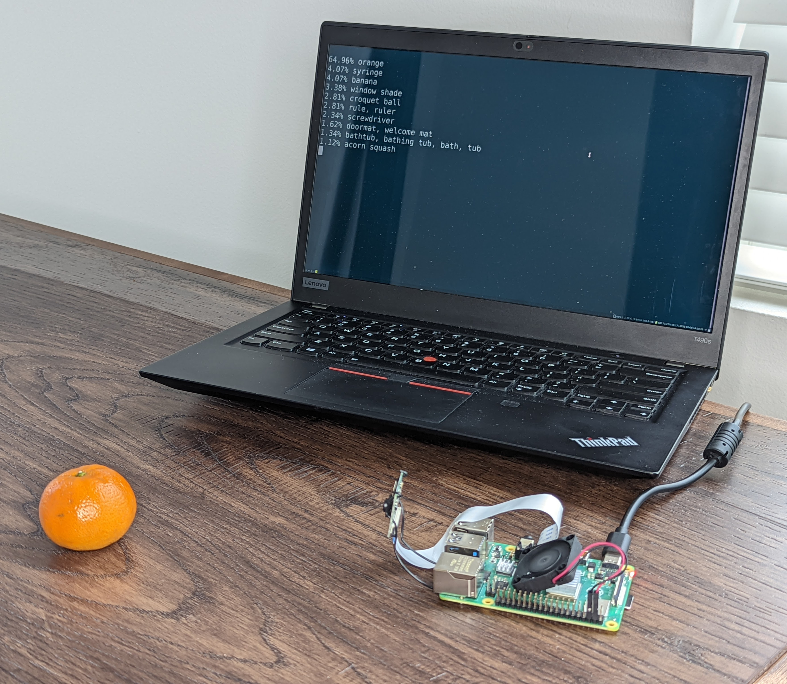

# 树莓派 4 上的实时推理 （30 FPS！）

> 译者：[masteryi-0018](https://github.com/masteryi-0018)
> 
> 项目地址：<https://pytorch.apachecn.org/2.0/tutorials/intermediate/realtime_rpi>
> 
> 原始地址：<https://pytorch.org/tutorials/intermediate/realtime_rpi.html>

作者：[Tristan Rice](https://github.com/d4l3k)

PyTorch对Raspberry Pi 4有开箱即用的支持。本教程将指导您如何设置Raspberry Pi 4以运行PyTorch并在CPU上运行MobileNet v2 的实时分类模型 （30 fps+）。

这一切都在Raspberry Pi 4 Model B 4GB上进行了测试，但应该适用于2GB 变体以及性能降低的 3B。


# 先决条件

要遵循本教程，您需要一个Raspberry Pi 4，一个相机以及所有其他标准配件。

- [树莓派 4 Model B 2GB+](https://www.raspberrypi.com/products/raspberry-pi-4-model-b/)

- [树莓派相机模块](https://www.raspberrypi.com/products/camera-module-v2/)

- 散热器和风扇（可选，但推荐）

- 5V 3A USB-C 电源

- SD 卡（至少 8GB）

- SD 卡读/写器

# 树莓派 4 设置

PyTorch只为Arm 64位（aarch64）提供pip包，所以你需要在Raspberry Pi上安装64位版本的操作系统。

您可以从 [https://downloads.raspberrypi.org/raspios_arm64/images/](https://downloads.raspberrypi.org/raspios_arm64/images/) 下载最新的arm64 Raspberry Pi OS，并通过rpi-imager进行安装。

**32位树莓派操作系统将无法工作。**


安装至少需要几分钟，具体取决于您的互联网速度和SD卡速度。完成后，它应该看起来像：


是时候将SD卡放入树莓派中了，连接相机并启动它。


启动并完成初始设置后，您需要编辑文件`/boot/config.txt`以启用相机。

```shell
# This enables the extended features such as the camera.
start_x=1

# This needs to be at least 128M for the camera processing, if it's bigger you can just leave it as is.
gpu_mem=128

# You need to commment/remove the existing camera_auto_detect line since this causes issues with OpenCV/V4L2 capture.
#camera_auto_detect=1
```

然后重新启动。重新启动后，video4linux2 设备应该存在`/dev/video0`。

# 安装 PyTorch 和 OpenCV

我们需要的 PyTorch 和所有其他库都有 ARM 64 位/aarch64 变体，因此您可以通过 pip 安装它们并让它像任何其他 Linux 系统一样工作。

```
$ pip install torch torchvision torchaudio
$ pip install opencv-python
$ pip install numpy --upgrade
```


现在我们可以检查所有内容是否正确安装：

```shell
$ python -c "import torch; print(torch.__version__)"
```


# 视频捕获

对于视频捕获，我们将使用OpenCV来流式传输视频帧。而不是更常见的`picamera`，*.piCamera* 在 64 位Raspberry Pi OS上不可用，它比OpenCV慢得多。OpenCV直接访问设备`/dev/video0`以抓取帧。

我们使用的模型（MobileNetV2）采用的图像大小是`224x224`，因此我们可以直接从 OpenCV 以 36fps 的速度请求。我们的目标是 30fps 模型，但我们要求比这略高的帧速率，所以总是有足够的帧。

```python
import cv2
from PIL import Image

cap = cv2.VideoCapture(0)
cap.set(cv2.CAP_PROP_FRAME_WIDTH, 224)
cap.set(cv2.CAP_PROP_FRAME_HEIGHT, 224)
cap.set(cv2.CAP_PROP_FPS, 36)
```

OpenCV 在 BGR 中返回一个`numpy`数组，因此我们需要读取并执行一些随机播放以使其转换为预期的 RGB 格式。

```python
ret, image = cap.read()
# convert opencv output from BGR to RGB
image = image[:, :, [2, 1, 0]]
```

这种数据读取和处理大约需要`3.5 ms`

# 图像预处理

我们需要获取帧并将它们转换为模型期望的格式。这与在任何具有标准`torchvision transforms`的机器上所做的处理相同。

```python
from torchvision import transforms

preprocess = transforms.Compose([
    # convert the frame to a CHW torch tensor for training
    transforms.ToTensor(),
    # normalize the colors to the range that mobilenet_v2/3 expect
    transforms.Normalize(mean=[0.485, 0.456, 0.406], std=[0.229, 0.224, 0.225]),
])
input_tensor = preprocess(image)
# The model can handle multiple images simultaneously so we need to add an
# empty dimension for the batch.
# [3, 224, 224] -> [1, 3, 224, 224]
input_batch = input_tensor.unsqueeze(0)
```

# Model选择

您可以选择多种Model以使用不同的性能特性。并非所有模型都提供`qnnpack`预训练的变体，因此测试目的，你应该选择一个可以测试的，但如果你训练和量化您自己的模型，您可以使用其中任何一个。

我们将`mobilenet_v2`用于本教程，因为它具有良好的性能和准确性。

树莓派 4 基准测试结果：

| Model              | FPS  | Total Time (ms/frame) | Model Time (ms/frame) | qnnpack Pretrained |
| ------------------ | ---- | --------------------- | --------------------- | ------------------ |
| mobilenet_v2       | 33.7 | 29.7                  | 26.4                  | True               |
| mobilenet_v3_large | 29.3 | 34.1                  | 30.7                  | True               |
| resnet18           | 9.2  | 109.0                 | 100.3                 | False              |
| resnet50           | 4.3  | 100.3                 | 225.2                 | False              |
| resnext101_32x8d   | 1.1  | 892.5                 | 885.3                 | False              |
| inception_v3       | 4.9  | 204.1                 | 195.5                 | False              |
| googlenet          | 7.4  | 135.3                 | 132.0                 | False              |
| shufflenet_v2_x0_5 | 46.7 | 21.4                  | 18.2                  | False              |
| shufflenet_v2_x1_0 | 24.4 | 41.0                  | 37.7                  | False              |
| shufflenet_v2_x1_5 | 16.8 | 59.6                  | 56.3                  | False              |
| shufflenet_v2_x2_0 | 11.6 | 86.3                  | 82.7                  | False              |

# MobileNetV2：量化和 JIT

为了获得最佳性能，我们需要一个量化和融合的模型。量化意味着它使用 int8 进行计算，这比 float32 标准运算的性能要高得多。融合意味着连续操作，在可能的情况下融合在一起形成性能更高的版本。常见事物像激活（`ReLU`）可以合并到（`Conv2d`）之前的层中在推理过程中。

aarch64版本的pytorch需要使用`qnnpack`引擎。

```python
import torch
torch.backends.quantized.engine = 'qnnpack'
```

在本例中，我们将使用Torchvision开箱即用的MobileNetV2的预量化和融合版本。

```python
from torchvision import models
net = models.quantization.mobilenet_v2(pretrained=True, quantize=True)
```

然后，我们要对模型进行 jit 以减少 Python 开销并融合任何操作。Jit 为我们提供了 ~30fps 而不是没有它的 ~20fps。

```python
net = torch.jit.script(net)
```

# 把它放在一起

现在，我们可以将所有部分放在一起并运行它：

```python
import time

import torch
import numpy as np
from torchvision import models, transforms

import cv2
from PIL import Image

torch.backends.quantized.engine = 'qnnpack'

cap = cv2.VideoCapture(0, cv2.CAP_V4L2)
cap.set(cv2.CAP_PROP_FRAME_WIDTH, 224)
cap.set(cv2.CAP_PROP_FRAME_HEIGHT, 224)
cap.set(cv2.CAP_PROP_FPS, 36)

preprocess = transforms.Compose([
    transforms.ToTensor(),
    transforms.Normalize(mean=[0.485, 0.456, 0.406], std=[0.229, 0.224, 0.225]),
])

net = models.quantization.mobilenet_v2(pretrained=True, quantize=True)
# jit model to take it from ~20fps to ~30fps
net = torch.jit.script(net)

started = time.time()
last_logged = time.time()
frame_count = 0

with torch.no_grad():
    while True:
        # read frame
        ret, image = cap.read()
        if not ret:
            raise RuntimeError("failed to read frame")

        # convert opencv output from BGR to RGB
        image = image[:, :, [2, 1, 0]]
        permuted = image

        # preprocess
        input_tensor = preprocess(image)

        # create a mini-batch as expected by the model
        input_batch = input_tensor.unsqueeze(0)

        # run model
        output = net(input_batch)
        # do something with output ...

        # log model performance
        frame_count += 1
        now = time.time()
        if now - last_logged > 1:
            print(f"{frame_count / (now-last_logged)} fps")
            last_logged = now
            frame_count = 0
```

运行它，可以发现我们徘徊在 ~30 fps。


这是Raspberry Pi OS中的所有默认设置。如果禁用了 UI 以及默认情况下启用的所有其他后台服务，它性能更高且更稳定。

如果我们检查，我们会发现我们的`htop`利用率几乎为 100%。


为了验证它是否端到端地工作，我们可以计算类，并[使用 ImageNet 类标签打印](https://gist.github.com/yrevar/942d3a0ac09ec9e5eb3a)检测结果。

```python
top = list(enumerate(output[0].softmax(dim=0)))
top.sort(key=lambda x: x[1], reverse=True)
for idx, val in top[:10]:
    print(f"{val.item()*100:.2f}% {classes[idx]}")
```

`mobilenet_v3_large`实时运行：


检测橙子：



检测杯子：


# 故障排除：性能

默认情况下，PyTorch 将使用所有可用的内核。如果你有什么在树莓派的后台运行可能会导致延迟峰值的模型推理。为了缓解这种情况，您可以减少线程数，可在较小的性能下减少峰值延迟开销。

```python
torch.set_num_threads(2)
```

对于`shufflenet_v2_x1_5`，使用`4 threads`而不是`2 threads`，增加最佳情况下的延迟，消除了的`72 ms 60 ms 128 ms`延迟峰值。

# 后续步骤

您可以创建自己的模型或微调现有模型。如果你微调来自[Torchvision.models.quantized](https://pytorch.org/vision/stable/models.html#quantized-models)的大部分融合和量化工作已经为您完成，因此您可以直接在树莓派上以良好的性能部署。

查看更多：

- 量化，了解有关如何[量化](https://pytorch.org/docs/stable/quantization.html)和融合模型的详细信息。

- 迁移学习[教程](https://pytorch.org/tutorials/beginner/transfer_learning_tutorial.html)，介绍如何使用迁移学习将预先存在的模型微调到数据集。