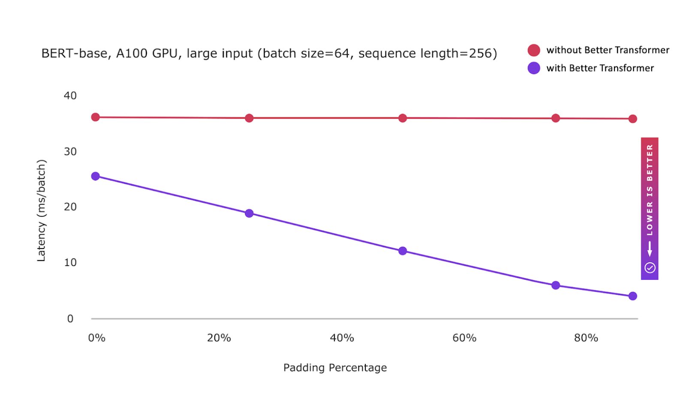

# 新版本: PyTorch 1.13 版本，包括functorch的测试版和对苹果新M1芯片的改进支持

> 发布: 2022年10月28日
> 
> 译者：[@片刻](https://github.com/jiangzhonglian)
> 
> 原文: <https://pytorch.org/blog/PyTorch-1.13-release/>
> 
> 翻译: <https://pytorch.apachecn.org/LatestChanges/PyTorch_V1.13>

**来自 PyTorch团队**

我们很高兴地宣布PyTorch® 1.13（[发布说明](https://github.com/pytorch/pytorch/releases/tag/v1.13.0)）的发布！这包括BetterTransformer的稳定版本。我们弃用了CUDA 10.2和11.3，并完成了CUDA 11.6和11.7的迁移。Beta版包括对Apple M1芯片和functorch的改进支持，该库提供可组合的vmap（矢量化）和自动差异转换，包含在PyTorch版本中。自1.12.1以来，此版本由超过3749个提交和467个贡献者组成。我们衷心感谢我们敬业的社区的贡献。

总结：

*   [BetterTransformer](https://pytorch.org/blog/PyTorch-1.13-release/#stable-features)功能集支持在开箱即用推理期间对常见的Transformer模型进行快速路径执行，而无需修改模型。其他改进包括变压器模型中常用的尺寸的加速添加+matmul线性代数内核，现在默认启用嵌套张量。
    
*   及时[弃用旧的CUDA版本](https://pytorch.org/blog/PyTorch-1.13-release/#introduction-of-cuda-116-and-117-and-deprecation-of-cuda-102-and-113)使我们能够在Nvidia®引入的最新CUDA版本时继续引入它们，因此允许在PyTorch和新的NVIDIA Open GPU内核模块中支持C++17。
    
*   此前，[functorch](https://pytorch.org/blog/PyTorch-1.13-release/#beta-features)在一个单独的软件包中发布。安装PyTorch后，用户将能够`import functorch`并使用functorch，而无需安装另一个软件包。
    
*   PyTorch正在为使用苹果新[M1芯片](https://pytorch.org/blog/PyTorch-1.13-release/#beta-support-for-m1-devices)作为测试版功能的Apple®硅机提供原生构建，为PyTorch的API提供更好的支持。
    

| Stable | Beta | Prototype |
| --- | --- | --- |
| [Better Transformer](https://pytorch.org/blog/PyTorch-1.13-release/#stable-bettertransformer-api) | [Enable Intel® VTune™ Profiler’s Instrumentation and Tracing Technology APIs](https://pytorch.org/blog/PyTorch-1.13-release/#intel) | [Arm® Compute Library backend support for AWS Graviton](https://pytorch.org/blog/PyTorch-1.13-release/#arm) |
| [CUDA 10.2 and 11.3 CI/CD Deprecation](https://pytorch.org/blog/PyTorch-1.13-release/#cuda10.2) | [Extend NNC to support channels last and bf16](https://pytorch.org/blog/PyTorch-1.13-release/#nnc) | [CUDA Sanitizer](https://pytorch.org/blog/PyTorch-1.13-release/#cudasanitizer) |
|   | [Functorch now in PyTorch Core Library](https://pytorch.org/blog/PyTorch-1.13-release/#beta-functorch) |   |
|   | [Beta Support for M1 devices](https://pytorch.org/blog/PyTorch-1.13-release/#betasupport) |   |

除了1.13，我们还发布了PyTorch库的重大更新，更多详细信息可以在本[博客](https://pytorch.org/blog/new-library-updates-in-pytorch-1.13/)中找到。

## Stable 功能

### （Stable）BetterTransformer API

在PyTorch 1.12中首次发布的[BetterTransformer](https://pytorch.org/blog/a-better-transformer-for-fast-transformer-encoder-inference/)功能集是稳定的。PyTorch BetterTransformer支持在开箱即用的推理期间对常见Transformer模型进行快速路径执行，而无需修改模型。为了补充Better Transformer的改进，我们还加快了变压器模型中常用尺寸的add+matmul线性代数内核。

反映许多NLP用户的性能优势，现在默认启用了用于Better的嵌套张量。为了确保兼容性，进行了掩码检查，以确保提供连续的掩码。在Transformer Encoder中，可以通过设置 mask_check=False来抑制src_key_padding_mask 的掩码检查。这加快了用户的处理速度，无法保证只提供对齐的掩码。最后，提供了更好的错误消息来诊断错误的输入，以及改进的诊断，为什么不能使用快速路径执行。

Better Transformer直接集成到PyTorch TorchText库中，使TorchText用户能够透明地自动利用BetterTransformer的速度和效率性能。（[教程](https://pytorch.org/tutorials/beginner/bettertransformer_tutorial.html)）



**图：**BetterTransformer快速路径执行现在稳定，并使用嵌套张量表示作为默认实现稀疏优化

### 引入CUDA 11.6和11.7，并弃用CUDA 10.2和11.3

及时弃用旧的CUDA版本使我们能够继续引入Nvidia®引入的最新CUDA版本，因此允许开发人员使用CUDA的最新功能，并从最新版本提供的正确性修复中受益。

CUDA 10.2的退役。CUDA 11是第一个支持C++17的CUDA版本。因此，停用遗留的CUDA 10.2是在PyTorch中添加对C++17的支持的重要一步。它还通过消除遗留的CUDA 10.2特定指令来帮助改进PyTorch代码。

CUDA 11.3的退役和CUDA 11.7的引入带来了对新NVIDIA开放GPU内核模块的兼容性支持，另一个重要的亮点是延迟加载支持。CUDA 11.7随附cuDNN 8.5.0，其中包含许多优化加速基于变压器的模型，库大小减少30%，以及运行时融合引擎的各种改进。通过我们的[发布说明](https://docs.nvidia.com/cuda/cuda-toolkit-release-notes/index.html)了解有关CUDA 11.7的更多信息。

## Beta 功能

### （Beta）functorch

受[Google® JAX](https://github.com/google/jax)的启发，functorch是一个提供可组合vmap（矢量化）和自动差异转换的库。它启用了高级自动差异用例，否则在PyTorch中表达起来会很棘手。例子包括：

*   [模型组装](https://pytorch.org/functorch/1.13/notebooks/ensembling.html)
*   [高效计算jacobians和hassians](https://pytorch.org/functorch/1.13/notebooks/jacobians_hessians.html)
*   [计算每个样本梯度（或其他每个样本的数量）](https://pytorch.org/functorch/1.13/notebooks/per_sample_grads.html)

我们很高兴地宣布，作为与PyTorch更紧密集成的第一步，functorch已经转移到PyTorch库中，不再需要安装单独的functorch包。通过conda或pip安装PyTorch后，您将能够在程序中“导入functorch”。通过我们的[详细说明](https://pytorch.org/functorch/1.13/install.html)、[夜间](https://pytorch.org/functorch/nightly/)和[发布说明](https://github.com/pytorch/pytorch/releases)了解更多信息。

### （Beta）Intel® VTune™ Profiler的仪器和追踪技术API（ITT）集成

当PyTorch用户需要在英特尔平台上使用低级性能指标分析每操作性能时，他们能够在英特尔®VTune™分析器中可视化PyTorch脚本执行的操作时间线。

```
with torch.autograd.profiler.emit_itt():
    for i in range(10):
        torch.itt.range_push('step_{}'.format(i))
        model(input)
        torch.itt.range_pop()
```

通过我们的[教程](https://pytorch.org/tutorials/recipes/profile_with_itt.html)了解更多信息。

### （Beta）NNC：添加BF16和频道最后支持

通过向NNC添加通道最后和BF16支持，提高了x86 CPU上的TorchScript图形模式推理性能。PyTorch用户可以从最受欢迎的x86 CPU上的通道上次优化中受益，并从英特尔库珀湖处理器和蓝宝石急流处理器上的BF16优化中受益。>通过英特尔库珀湖处理器上的这两个优化，在宽视模型上观察到2X的地理平均性能提升。

性能优势可以通过现有的TorchScript、channel last和BF16 Autocast API获得。请参阅下面的代码片段。我们将把NNC中的优化迁移到新的PyTorch DL编译器TorchInductor。

```
import torch
import torchvision.models as models
model = models.resnet50(pretrained=True)
# Convert the model to channels-last
model = model.to(memory_format=torch.channels_last)
model.eval()
data = torch.rand(1, 3, 224, 224)
# Convert the data to channels-lastdata = data.to(memory_format=torch.channels_last)
# Enable autocast to run with BF16
with torch.cpu.amp.autocast(), torch.no_grad():
# Trace the model
model = torch.jit.trace(model, torch.rand(1, 3, 224, 224))
	model = torch.jit.freeze(model)
	# Run the traced model
	model(data)
```

### （Beta）支持M1设备

自v1.12以来，PyTorch一直为使用苹果新M1芯片作为原型功能的Apple®硅机器提供原生构建。在此版本中，我们将此功能带到测试版中，为PyTorch的API提供更好的支持。

我们现在在M1 macOS 12.6实例上为除`torch.distributed`以外的所有子模块运行测试。通过这种改进的测试，我们能够修复某些输入的cpp扩展和卷积正确性等功能。

要开始使用Python本机版本（arm64）的运行macOS 12或更高版本的Apple Silicon Mac上安装PyTorch v1.13。通过我们的[发布说明](https://github.com/pytorch/pytorch/releases)了解更多信息。

## Prototype 功能

### （Prototype）Arm®计算库（ACL）对AWS Graviton的后端支持

我们对带有Arm Compute Library（acl）的aarch64 cpu上的CV和NLP推理进行了重大改进，以启用pytorch和torch-xla模块的acl后端。亮点包括：

*   启用mkldnn + acl作为aarch64火炬轮的默认后端。
*   为aarch64 bf16设备启用mkldnn matmul运算符。
*   将TensorFlow xla+acl功能带入火炬-xla。我们为aarch64 cpu增强了带有Arm Compute Library运行时的TensorFlow xla。这些更改包含在TensorFlow master中，然后包含在即将到来的TF 2.10中。一旦tarch-xla repo为tensorflow提交更新，它将对tarch-xla进行编译支持。与Graviton3上的火炬1.12轮相比，我们观察到MLPerf Bert推断的改进了约2.5-3倍。

### （Prototype）CUDA消毒剂

启用后，消毒器开始分析因用户的PyTorch代码而调用的低级CUDA操作，以检测来自不同CUDA流的不同步数据访问导致的数据竞赛错误。然后，发现的错误与错误访问的堆栈痕迹一起打印，就像[Thread Sanitizer](https://clang.llvm.org/docs/ThreadSanitizer.html)一样。一个简单的错误和消毒剂产生的输出的例子可以[在这里](https://gist.github.com/sypneiwski/5989d634f7090913b80012be835e811d)查看。它对机器学习应用程序特别有用，在这种应用中，损坏的数据对人类来说很容易被错过，错误可能并不总是表现出来；消毒剂将始终能够检测到它们。

### （Prototype）有限的Python 3.11支持

支持Python 3.11的Linux二进制文件可以通过pip下载。请按照[入门页面上](https://pytorch.org/get-started/locally/)的说明进行操作。请注意，Python 3.11支持只是一个预览。特别是，包括分布式、分析器、FX和JIT在内的功能可能尚未完全正常工作。